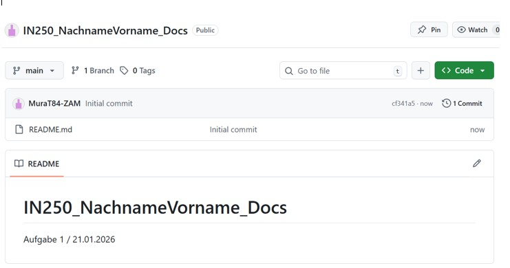
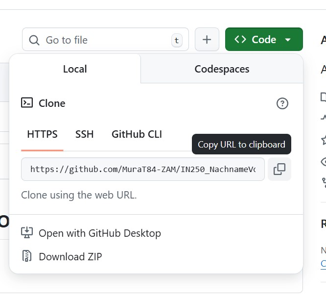
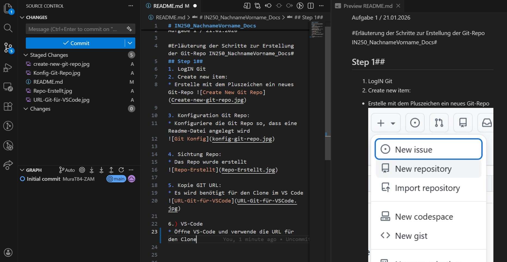
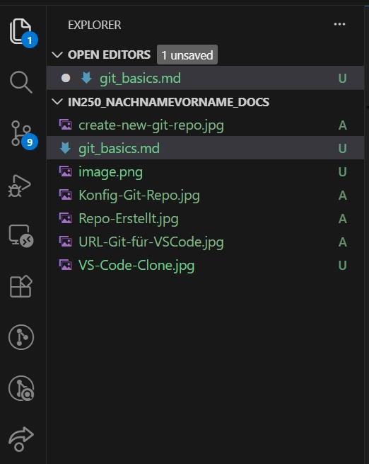
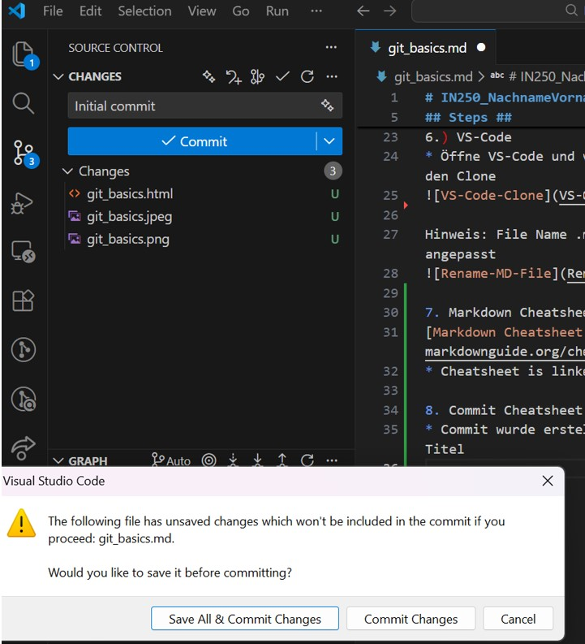
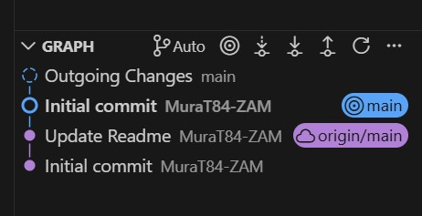
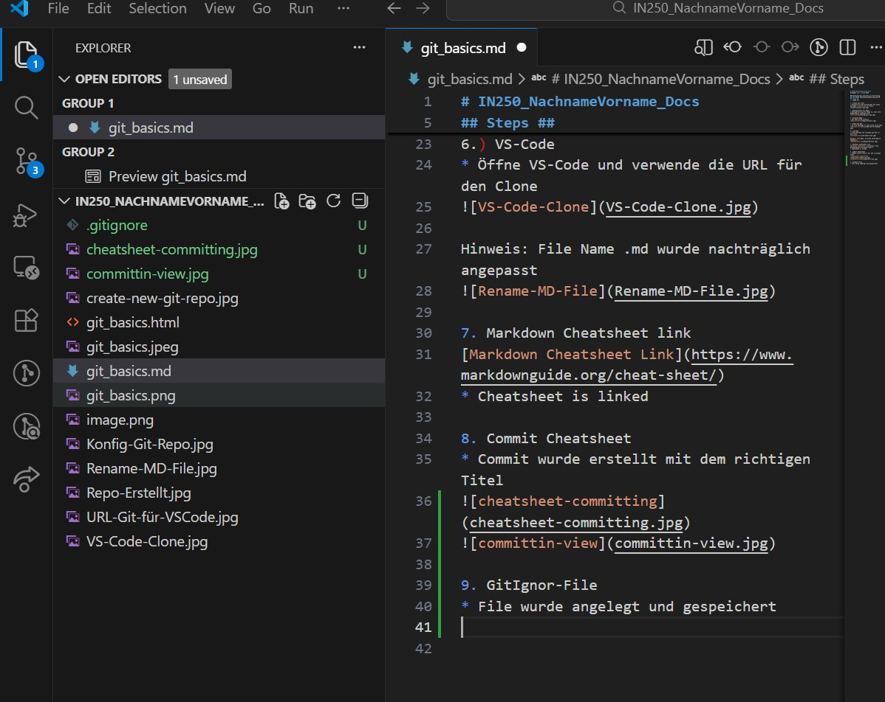
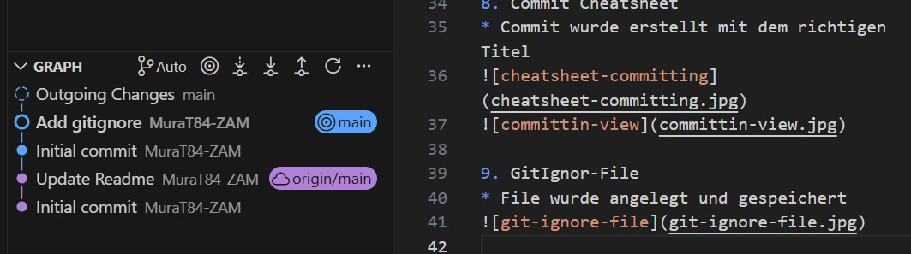
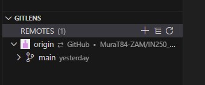

# IN250_NachnameVorname_Docs
Aufgaben 1-5 / 21.01.2026

#Erläuterung der Schritte zur Erstellung der Git-Repo IN250_NachnameVorname_Docs#
## Steps ##
1. LogIN Git

2. Create new item: 
* Erstelle mit dem Pluszeichen ein neues Git-Repo 

3. Konfiguration Git Repo:
* Konfiguriere die Git Repo so, dass eine Readme-Datei angelegt wird

4. Sichtung Repo:
* Das Repo wurde erstellt

5. Kopie GIT URL:
* Es wird benötigt für den Clone im VS Code

6.) VS-Code
* Öffne VS-Code und verwende die URL für den Clone 

Hinweis: File Name .md wurde nachträglich angepasst

7. Markdown Cheatsheet link
[Markdown Cheatsheet Link](https://www.markdownguide.org/cheat-sheet/)
* Cheatsheet is linked 

8. Commit Cheatsheet
* Commit wurde erstellt mit dem richtigen Titel

9. GitIgnor-File
* File wurde angelegt und gespeichert

* File wurde committed

10. Zweites lokales Repository und Remote Origin

Es wurde ein weiteres lokales Repository in einem neuen Ordner erstellt und in Visual Studio Code geöffnet.

* Schritte
1. Neuer leerer Ordner wurde erstellt und in VS Code geöffnet.
2. Das Repository wurde über die GUI mit Git Init initialisiert.
3. Der bestehende GitHub-Repository wurde als Remote Origin hinzugefügt.
4. Das lokale Repository wurde mit dem Remote synchronisiert.

* Kontrolle der Tätigkeiten
- Der Remote **origin** ist vorhanden und zeigt auf das bestehende GitHub-Repository.
- Der Branch **main** ist sichtbar.
- Die Verbindung wurde erfolgreich über GitLens überprüft.

* Beobachtung
Mehrere lokale Repositories können mit demselben GitHub-Repository verbunden werden.  
Änderungen, die in einem lokalen Repository gepusht werden, können in einem anderen lokalen Repository durch Synchronisation übernommen werden.

11. Weshalb wird Git im SW-Entwicklungsprozess verwendet

| Schlüsselwort | Beschreibung |
| ----------- | ----------- |
| Tracebility | Via Git können Änderungen am code nachvollzogen werden d.h. wer hat was wann geändert |
| Kollaboration | Mehrere Personen können auf der gleichen Plattform bequem zusammenarbeiten |
|Wiederherstellung| Frühere Versionen können einfach wiederhergestellt werden
|Backup | Der Code wir lokal und remote sichergestellt d.h. redundant verfügbar.

* weshalb ist git commit/push wichtiger als das eigene leben?

| Schlüsselwort | Beschreibung |
| ----------- | ----------- |
|Commit| Die eigene Arbeit wird lokal gespeichert
|Push| Die eigene Arbeit wird extern gespeicher d.h. das Backup

sobald der Code gesichert ist kann man in Ruhe sterben

12. Dokumentation ins Repository aufnehmen

* Die Datei `git_basics.md` wurde gespeichert.
* Die Änderungen wurden über die Source-Control-Ansicht in Visual Studio Code committed.
* Der Commit wurde mit dem bestehenden GitHub-Repository synchronisiert.

### Ergebnis
- Die Dokumentation ist Teil des Repositories.
- Der lokale Stand und das Remote-Repository sind identisch.
- Die Aufgabe ist vollständig abgeschlossen.
